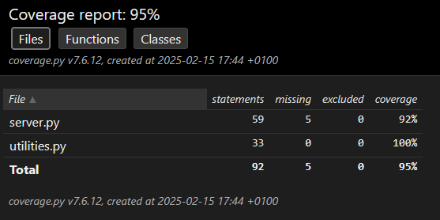

# OC Projet 11: Gudlft

## :v:Présentation du projet:

Ce projet s’inscrit dans le cadre du parcours "Développeur d’application Python" sur OpenClassrooms.  
Le projet Gudlft est une plateforme numérique pour coordonner les compétitions de force (deadlifting, strongman) en Amérique du Nord et en Australie. L'objectif du projet est de créer un site plus léger pour l'organisation de competition au niveau regional, le projet est au stade du prototypage et utilise le microframework Flask.  

Une base a déja été implémenté mais comporte des bugs et doit etre compléter avec une nouvelle feature. L'objectif est donc de reprendre le projet en suivant une methodologie de developpement professionelle avec la creation de branche git pour la correction de chaque bugs ou l'ajout de la nouvelle feature et qui comporte des tests avant l'intergration dans la branche principale. De plus, des tests de fonctionnalité et de perforance sont ajouter pour etre conforme au spécification du cahier des charges.

## Methodologie:

Chaque étape a été implémenté dans une nouvelle branche git et est accompagné de test unitaire et d'integration  
1. Refacting du code de base en séparant l'application flask et la gestion des données et ajout des tests unitaire et d'intégration
2. Résolution de l'issue 1: bug de l'application si un mauvais email est saisi dans la partie login.
3. Résolution de l'issue 2: Empecher la réservation de plus de place que le club n'a de points et deduction des points du club a chaque nouvelle reservation.
4. Résolution de l'issue 3: Eviter que le club ne puisse réserver plus de 12 places.
5. Résolution de l'issue 4: Empecher la reservation de place sur des competitions déjà passé.
6. Ajout de la feature: Ajout d'une page en accès libre pour voir la balance des point de chaque club
7. Refactoring du html et ajout de css avec tailwind
8. Ajout des tests fonctionnel et de performance

## Installation
Récupération du dépôt avec Git.
```
git clone https://github.com/PVL06/OC_P11_Gudlft.git
```
Environnement virtuel et dépendances.
```
cd OC_P11_Gudlft
python -m venv env

# Windows
env/Script/activate
# Linux
source env/bin/activate

pip install -r requirements.txt
```
Lancement du serveur
```
python server.py
```

## Tests
