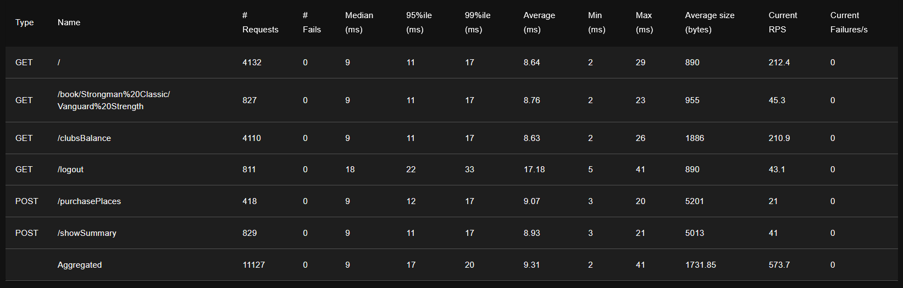

# OC Projet 11: Gudlft

## :v:Présentation du projet:

Ce projet s’inscrit dans le cadre du parcours "Développeur d’application Python" sur OpenClassrooms.  
  
Le projet Gudlft est une plateforme numérique visant à coordonner les compétitions de force (deadlifting, strongman) en Amérique du Nord et en Australie. Son objectif est de proposer un site plus léger pour l'organisation de compétitions au niveau régional. Actuellement au stade du prototypage, il repose sur le microframework Flask.
  
Une base a déjà été implémentée, mais elle contient des bugs et doit être complétée avec une nouvelle fonctionnalité. L'objectif est donc de reprendre le projet en appliquant une méthodologie de développement rigoureuse, notamment en utilisant Git pour créer des branches dédiées à la correction de chaque bug ou à l'ajout de la nouvelle fonctionnalité. Chaque modification devra être accompagnée de tests avant son intégration dans la branche principale.
  
Par ailleurs, des tests fonctionnels et de performance seront ajoutés afin de garantir la conformité du projet avec les spécifications du cahier des charges.

## :triangular_ruler:Methodologie:

Chaque étape a été implémentée dans une nouvelle branche Git et est accompagnée de tests unitaires et d'intégration. 
1. Refactoring du code de base en séparant l'application Flask de la gestion des données, et ajout de tests unitaires et d'intégration.
2. Résolution de l'issue 1 : Correction d'un bug provoquant une erreur lorsque un mauvais email est saisi lors de la connexion.
3. Résolution de l'issue 2 : Empêcher la réservation de plus de places que le club ne possède de points et déduire les points du club à chaque nouvelle réservation.
4. Résolution de l'issue 3 : Limiter la réservation à un maximum de 12 places par club.
5. Résolution de l'issue 4 : Empêcher la réservation de places pour des compétitions déjà passées.
6. Ajout d'une fonctionnalité : Création d'une page en accès libre permettant de consulter la balance des points de chaque club.
7. Refactoring du HTML et ajout de styles avec Tailwind CSS.
8. Ajout de tests fonctionnels et de performance.

## :arrow_heading_down:Installation
Récupération du dépôt en local avec Git.
```
git clone https://github.com/PVL06/OC_P11_Gudlft.git
```
Environnement virtuel et dépendances.
```
cd OC_P11_Gudlft
python -m venv env

# Windows
env/Script/activate
# Linux
source env/bin/activate

pip install -r requirements.txt
```
Lancement du serveur
```
python server.py
```

## :white_check_mark:Tests
### Couverture des tests:  

  \
Pour plus de détails, ouvrez le fichier index.html du dossier htmlcov dans un navigateur.

### Test de performance:
